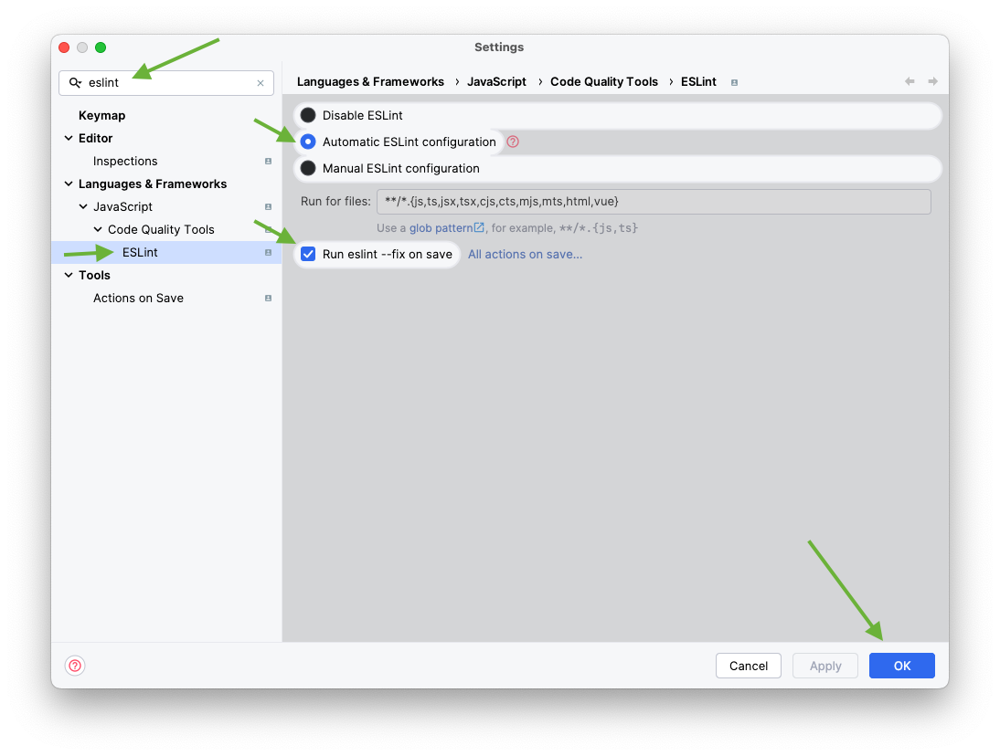

# ESLint Config
The ESLint Configuration package for the Node.js TypeScript Developers

## Installation
### Install dependencies
```shell
npm i -D \
  @eslint/js@9 \
  @types/eslint__js@8 \
  @typescript-eslint/eslint-plugin@8 \
  @typescript-eslint/parser@8 \
  eslint@9 \
  eslint-config-prettier@9 \
  eslint-plugin-import@2 \
  eslint-plugin-prettier@5 \
  eslint-plugin-simple-import-sort@12 \
  eslint-plugin-unused-imports@4 \
  eslint-import-resolver-typescript@3 \
  prettier@3 \
  typescript-eslint@8
```

### ESLint flat config
Create `eslint.config.js` file in your project root folder and paste content from [eslint.config.js](./eslint.config.js) file  
(Just copy file `eslint.config.js` to your project root)

### Prettier config
Paste this `Prettier` config into your `package.json` file:
```json
  "prettier": {
    "singleQuote": true,
    "trailingComma": "all",
    "printWidth": 120,
    "tabWidth": 2,
    "endOfLine": "lf"
  },
```

Project's file `package.json` should be like this:
```json
{
  "name": "name",
  "version": "x.x.x",
  "scripts": {},
  "prettier": {
    "singleQuote": true,
    "trailingComma": "all",
    "printWidth": 120,
    "tabWidth": 2,
    "endOfLine": "lf"
  },
  "devDependencies": {},
  "dependencies": {}
}
```

## Enabling
To enable ESLint in WebStorm:
1. Make sure that your `WebStorm` has at least version `2024.1`
2. Open `Settings`
3. Type `eslint` in search field
4. Open `Languages & Frameworks` -> `JavaScript` -> `Code Quality Tools` -> `ESLint`
5. Select `Automatic ESLint configuration` and `Run eslint --fix on save`
6. Click `OK`  

After that steps your code will be automatically formatted on each save:
* On `ctrl + S` or `⌘ + S`
* Changing focus to other file
* Changing focus to other window
* Making commit
* and other actions

